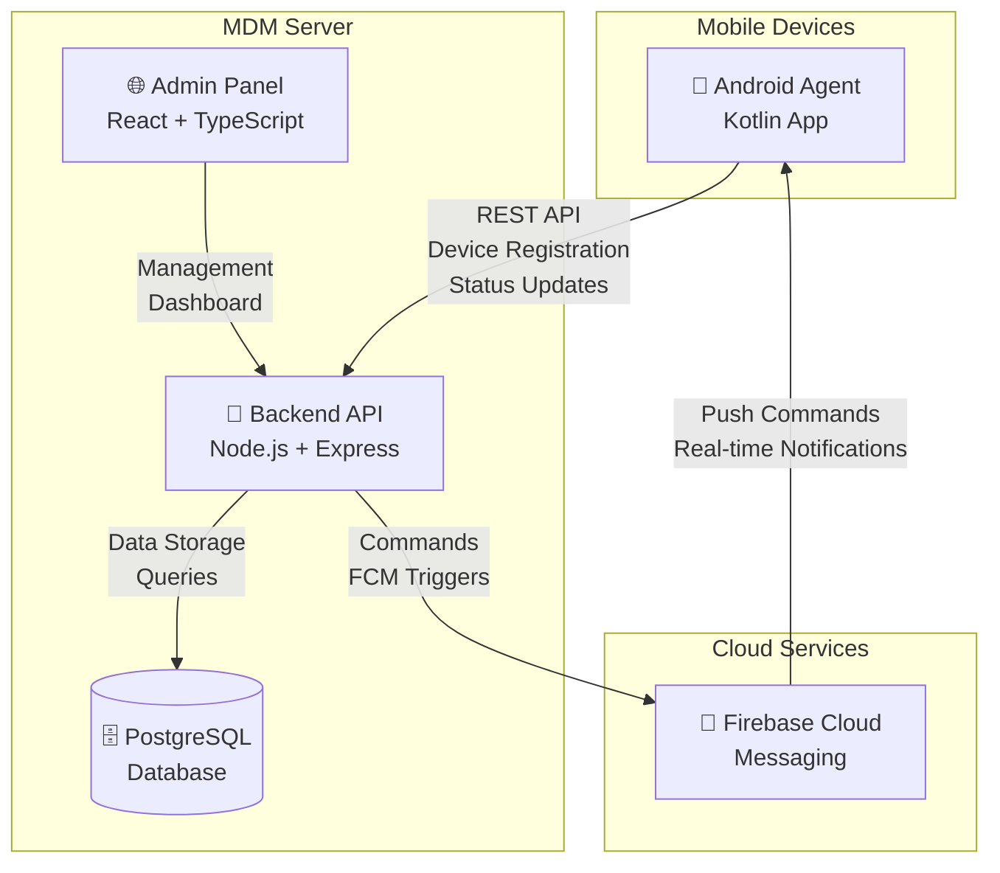

# 📱 Android MDM (Mobile Device Management) System

[](https://www.docker.com/)
[](https://nodejs.org/)
[](https://reactjs.org/)
[](https://www.typescriptlang.org/)
[](https://www.postgresql.org/)

**Complete enterprise-grade Mobile Device Management (MDM) solution** with modern React admin interface, robust Node.js API, and native Android agent.

## 🚀 Quick Start

### Prerequisites
- [Docker](https://docs.docker.com/get-docker/) and [Docker Compose](https://docs.docker.com/compose/install/)
- Git (for cloning the repository)

### 🐳 Docker Setup (Recommended)

The project includes a complete Docker Compose setup for seamless development:

**Services Included:**
- 🗄️ **PostgreSQL 15** - Database (port 5435)
- 🔧 **Backend API** - Node.js/Express server (port 3000)
- 🌐 **React Admin Panel** - Modern web interface (port 8080)

### Start Development Environment

**Option A: Using Helper Script** ⚡
```bash
git clone https://github.com/Sokphirun99/mdm_project.git
cd mdm_project
./dev.sh start
```

**Option B: Direct Docker Compose**
```bash
git clone https://github.com/Sokphirun99/mdm_project.git
cd mdm_project
docker compose -f docker-compose.dev.yml up -d --build
```

### 🎯 Access Your Services

After startup (typically 30-60 seconds):
- 🌐 **Admin Interface**: http://localhost:8080
- 🔧 **Backend API**: http://localhost:3000
- 📊 **API Health Check**: http://localhost:3000/api/health
- 🗄️ **Database**: localhost:5435 (PostgreSQL)

### 🔑 Default Credentials
```
Email: admin@example.com
Password: admin1234
```

### 🛠️ Development Commands

```bash
./dev.sh start     # Start all services
./dev.sh stop      # Stop all services  
./dev.sh restart   # Restart all services
./dev.sh logs      # View combined logs
./dev.sh rebuild   # Rebuild and restart
./dev.sh db-reset  # Reset database (⚠️ destroys data)
```

### 🌍 LAN Access Setup

To access from mobile devices on your network:

```bash
# Find your local IP
ifconfig | grep "inet " | grep -v 127.0.0.1

# Set environment variables (replace with your IP)
export SERVER_URL="http://192.168.1.50:3000"
export API_BASE_URL="http://192.168.1.50:3000/api"
export ALLOWED_ORIGINS="http://192.168.1.50:8080"

# Restart with new configuration
./dev.sh restart
```

📖 **See [LAN_ACCESS_SETUP.md](./LAN_ACCESS_SETUP.md) for detailed network configuration.**

## 🏗️ Architecture Overview



### 🔄 Communication Flow
1. **Device Enrollment**: Android agent registers via QR code or manual setup
2. **Real-time Commands**: Admin panel sends commands through FCM
3. **Status Reporting**: Devices report back status, telemetry, and compliance
4. **Policy Enforcement**: Automated policy application and monitoring

## 📦 Components

### 📱 Android MDM Agent (`android-mdm-agent/`)
**Native Android application for device management**

| Feature | Technology | Status |
|---------|------------|--------|
| **Language** | Kotlin | ✅ Active |
| **Architecture** | Android Enterprise | ✅ Implemented |
| **Device Admin** | DeviceAdminReceiver | ✅ Configured |
| **Communication** | REST API + FCM | ✅ Integrated |
| **Permissions** | Device Owner/Profile Owner | ✅ Ready |

**Key Capabilities:**
- 🔐 Device enrollment via QR code scanning
- 📱 Silent app installation/uninstallation
- 🛡️ Security policy enforcement
- 📊 Real-time device monitoring and telemetry
- 🔒 Remote lock and wipe functionality
- 📍 Location tracking (when enabled)

### 🌐 React Admin Panel (`react-admin-panel/`)
**Modern web-based administration interface**

| Feature | Technology | Status |
|---------|------------|--------|
| **Framework** | React 18 + TypeScript | ✅ Production Ready |
| **Build Tool** | Vite | ✅ Optimized |
| **UI Library** | TailwindCSS v3 | ✅ Responsive |
| **Icons** | Lucide React | ✅ Modern |
| **State Management** | React Context + TanStack Query | ✅ Efficient |
| **Routing** | React Router v6 | ✅ SPA |
| **Container** | Nginx Alpine | ✅ Lightweight |

**Admin Features:**
- 📊 **Dashboard**: Real-time statistics and health (Socket.IO/SSE), org/time filters, mini charts, live events ticker
- 📱 **Device Management**: Search, filter (status/org), paginate, bulk lock/unlock/wipe with live updates
- 🛡️ **Policy Management**: Create/update/delete policies with audit (actorId/requestId)
- �️ **Events & Alerts**: Live feed with filters/pause; dedicated Events page (server-side pagination + CSV export)
- ⚡ **Command Center**: Queue and track commands; pipeline metrics (queued/in-flight/completed/failed)
- 📈 **Monitoring**: Compliance breakdowns, last check-in buckets, platform/OS splits, health signals
- ⚙️ **Settings**: System configuration and user management

Note: The old Go-based polling diagram has been replaced by a Node/Express + Socket.IO architecture described in the Architecture Overview above.

### 🔧 Backend Server (`backend-server/`)
**Robust API server with enterprise features**

| Feature | Technology | Status |
|---------|------------|--------|
| **Runtime** | Node.js 20.x | ✅ Production Ready |
| **Framework** | Express.js | ✅ RESTful API |
| **Language** | TypeScript | ✅ Type Safety |
| **Database** | PostgreSQL 15 | ✅ ACID Compliant |
| **ORM** | Prisma | ✅ Type-safe |
| **Authentication** | JWT + bcrypt | ✅ Secure |
| **Messaging** | Firebase Cloud Messaging | ✅ Real-time |
| **Documentation** | Swagger/OpenAPI | ✅ Auto-generated |

**API Capabilities:**
- 🔐 **Authentication**: JWT-based secure authentication
- 📱 **Device Management**: Registration, status tracking, commands
- 🛡️ **Policy Engine**: Flexible policy creation and enforcement  
- 📦 **Application Store**: App deployment and management
- ⚡ **Real-time Commands**: FCM-powered instant communication
- 📊 **Analytics**: Device telemetry and compliance monitoring
- 🔒 **Security**: Rate limiting, CORS, input validation

## ✨ Key Features

### 📱 Device Management
| Feature | Status | Description |
|---------|--------|-------------|
| 🆔 **Device Enrollment** | ✅ **Complete** | QR code-based device registration |
| 📋 **Device Profiles** | ⚠️ **Basic** | Device information and configuration |
| 🔍 **Device Discovery** | ⚠️ **Partial** | Network-based device identification |
| 📊 **Device Inventory** | ✅ **Complete** | Comprehensive device tracking |
| 🏷️ **Device Grouping** | ✅ **Complete** | Organizational device management |

### 📦 Application Management
| Feature | Status | Description |
|---------|--------|-------------|
| 📲 **Silent Installation** | ✅ **Complete** | Background app deployment |
| 🗑️ **Silent Uninstallation** | ✅ **Complete** | Remote app removal |
| 🔐 **Permission Management** | ⚠️ **App-level** | Application permission control |
| ✅ **App Allowlisting** | ✅ **Complete** | Approved application management |
| ❌ **App Blocklisting** | ✅ **Complete** | Restricted application enforcement |
| 📊 **App Usage Analytics** | ⚠️ **Basic** | Application usage tracking |

### 🛡️ Security & Compliance
| Feature | Status | Description |
|---------|--------|-------------|
| 🔒 **Remote Device Lock** | ✅ **Complete** | Instant device security lock |
| 💥 **Remote Wipe** | ✅ **Complete** | Factory reset with confirmation |
| 🔑 **Password Policies** | ✅ **Complete** | Enforced password requirements |
| 📷 **Hardware Restrictions** | ❌ **Planned** | Camera, USB, storage controls |
| 🏪 **Play Store Control** | ❌ **Planned** | App store access management |
| 🔍 **Compliance Monitoring** | ⚠️ **Basic** | Policy compliance tracking |

### 📊 Monitoring & Analytics
| Feature | Status | Description |
|---------|--------|-------------|
| 📍 **Location Tracking** | ❌ **Planned** | GPS-based device location |
| 🔋 **Battery Monitoring** | ⚠️ **Basic** | Battery status reporting |
| 📶 **Network Analytics** | ⚠️ **Basic** | Network usage and connectivity |
| 🏥 **Device Health** | ⚠️ **Basic** | System health monitoring |
| 📈 **Usage Reports** | ❌ **Planned** | Detailed usage analytics |
| ⚠️ **Alert System** | ⚠️ **Basic** | Policy violation notifications |

### 🔔 Real-time Communication
| Feature | Status | Description |
|---------|--------|-------------|
| 📨 **Firebase Cloud Messaging** | ✅ **Complete** | Instant command delivery |
| ⚡ **Command Execution** | ✅ **Complete** | Real-time device commands |
| 📊 **Status Reporting** | ✅ **Complete** | Live device status updates |
| 🔄 **Bidirectional Sync** | ✅ **Complete** | Two-way data synchronization |

#### Realtime & Events
- Socket rooms: stats scoped by organizationId + time window, events scoped by organizationId
- SSE fallback: `GET /api/dashboard/stats/stream?organizationId=...&windowMinutes=...&longWindowMinutes=...`
- Events API:
    - List: `GET /api/events?page=1&pageSize=25&organizationId=ORG_ID&deviceId=...&type=...&severity=...&from=ISO&to=ISO&search=...`
    - CSV: `GET /api/events/export?organizationId=...&severity=...&from=...&to=...`

### Legend
- ✅ **Complete**: Fully implemented and tested
- ⚠️ **Partial/Basic**: Basic implementation, can be enhanced
- ❌ **Planned**: Not yet implemented, roadmap item

## 🔧 Local Development (Alternative to Docker)

### Backend Server
```bash
# Navigate to backend directory
cd backend-server

# Install dependencies
npm install

# Set up environment variables
cp .env.example .env
# Edit .env with your database credentials

# Run database migrations
npm run migrate

# Seed initial data
npm run seed

# Start development server
npm run dev
```
**Backend will be available at**: http://localhost:3000

### React Admin Panel
```bash
# Navigate to admin panel directory
cd react-admin-panel

# Install dependencies
npm install

# Start development server (with API proxy)
VITE_API_BASE_URL=http://localhost:3000/api npm run dev
```
**Admin panel will be available at**: http://localhost:5173

> Tip: Use Node 20.19+ or 22.12+ to silence Vite’s engine warning during builds.

### Production Build
```bash
# Build optimized React application
cd react-admin-panel
npm run build

# Build output will be in ./dist directory
# Serve with any static file server (nginx, Apache, etc.)
```

## 🗄️ Database & Migrations

### Automatic Setup (Docker)
The Docker environment automatically:
- ✅ Runs database migrations on startup
- ✅ Seeds initial admin user and test data
- ✅ Configures PostgreSQL with proper settings

### Manual Database Management
```bash
# Run migrations manually
docker exec mdm_backend_dev npm run migrate

# Seed database with initial data
docker exec mdm_backend_dev npm run seed

# Reset database (⚠️ destroys all data)
./dev.sh db-reset
```

### Database Schema
The system uses Prisma ORM with the following main entities:
- 👤 **Users** - Admin users and authentication
- 📱 **Devices** - Enrolled mobile devices
- 🛡️ **Policies** - Security and configuration policies
- 📦 **Applications** - Managed applications
- ⚡ **Commands** - Device commands and execution history
- 📊 **Telemetry** - Device monitoring and analytics data

## 🚀 Production Deployment

### Using Production Docker Compose
```bash
# Create production environment file
cp .env.example .env
# Edit .env with production settings

# Deploy with production configuration
./deploy.sh
```

### Manual Production Deployment
1. **Database Setup**: Configure PostgreSQL 15+
2. **Backend Deployment**: Deploy Node.js app with PM2 or similar
3. **Frontend Deployment**: Build React app and serve with nginx
4. **SSL Configuration**: Set up HTTPS with Let's Encrypt or similar
5. **Environment Variables**: Configure production secrets

📖 **See [DEPLOYMENT.md](./DEPLOYMENT.md) for detailed production deployment guide.**

## 🔍 Troubleshooting

### Common Issues

#### 🔄 "Relation 'users' does not exist" Error
**Symptoms**: 500 error on login, database connection issues
```bash
# Solution: Run migrations manually
docker exec mdm_backend_dev npm run migrate
docker exec mdm_backend_dev npm run seed
```

#### 🎨 Admin UI Missing Styles
**Symptoms**: Unstyled React interface, CSS not loading
```bash
# Solution: Rebuild admin container with Tailwind
docker compose -f docker-compose.dev.yml build admin
docker compose -f docker-compose.dev.yml up -d --build
```

#### 🔌 Port Conflicts
**Symptoms**: "Port already in use" errors
```bash
# Check what's using the ports
lsof -i :3000 -i :8080 -i :5435

# Stop conflicting services or change ports in docker-compose.dev.yml
```

#### 🐳 Docker Issues
```bash
# Clean up Docker resources
docker system prune -f

# Rebuild everything from scratch
docker compose -f docker-compose.dev.yml down -v
docker compose -f docker-compose.dev.yml build --no-cache
docker compose -f docker-compose.dev.yml up -d
```

#### 📱 Android Agent Connection Issues
**Symptoms**: Device can't connect to API
1. **Network Access**: Ensure phone and computer are on same network
2. **Firewall**: Check if ports 3000/8080 are accessible
3. **Environment Variables**: Set `SERVER_URL` to your LAN IP
4. **Network Security Config**: Verify Android app allows cleartext HTTP

#### 🔐 Authentication Problems
**Symptoms**: Login failures, token issues
```bash
# Reset admin password
docker exec mdm_backend_dev npm run seed

# Check JWT secret configuration
docker exec mdm_backend_dev printenv | grep JWT_SECRET
```

### Debug Commands
```bash
# Check service health
docker compose ps
curl http://localhost:3000/api/health

# View logs for specific service
docker compose logs backend --tail=50
docker compose logs admin --tail=50
docker compose logs db --tail=50

# Access backend container shell
docker exec -it mdm_backend_dev /bin/sh

# Check database connection
docker exec mdm_backend_dev npm run db:test
```

### Performance Optimization
```bash
# Clean up build cache and unused images
docker system prune -f
docker image prune -f

# Monitor container resource usage
docker stats

# Database performance check
docker exec mdm_db_dev psql -U postgres -d mdm_database -c "SELECT version();"
```

## 📚 Documentation

### Component Documentation
- 📱 **[Android Agent Guide](./android-mdm-agent/README.md)** - Mobile app development and deployment
- 🌐 **[React Admin Panel](./react-admin-panel/README.md)** - Web interface development
- 🔧 **[Backend API Documentation](./backend-server/README.md)** - Server setup and API reference

### Deployment & Operations
- 🚀 **[Production Deployment Guide](./DEPLOYMENT.md)** - Complete production setup
- 🌍 **[LAN Access Configuration](./LAN_ACCESS_SETUP.md)** - Network setup for device enrollment
- 📊 **[Project Status](./PROJECT_STATUS.md)** - Current implementation status
- 🔄 **[Migration History](./MIGRATION.md)** - Flutter to React migration details

### API Documentation
- 📖 **Swagger/OpenAPI**: http://localhost:3000/api-docs (when backend is running)
- 🔧 **Postman Collection**: Available in `./docs/api/` directory
- 📝 **API Endpoints**: Detailed in backend README

## 🔒 Security Considerations

### Production Security Checklist
- [ ] **Environment Variables**: Use strong, unique secrets in production
- [ ] **HTTPS**: Enable SSL/TLS for all web traffic
- [ ] **Database Security**: Use SSL connections and strong passwords
- [ ] **JWT Secrets**: Generate cryptographically secure JWT secrets
- [ ] **CORS Configuration**: Restrict origins to trusted domains only
- [ ] **Rate Limiting**: Configure appropriate API rate limits
- [ ] **Input Validation**: Ensure all inputs are properly validated
- [ ] **Security Headers**: Implement proper HTTP security headers
- [ ] **Android Security**: Use Android Enterprise features for enhanced security
- [ ] **Device Certificates**: Implement device-specific certificates for authentication

### Enterprise Features
- 🏢 **Android Enterprise Integration**: Full Android Enterprise API support
- 🔐 **Device Owner Mode**: Maximum device control capabilities
- 📜 **Certificate Management**: PKI-based device authentication
- 🛡️ **Zero-Touch Enrollment**: Automated device provisioning
- 📊 **Audit Logging**: Comprehensive action and change logging
- 🔒 **End-to-End Encryption**: Secure command and data transmission

## 🤝 Contributing

We welcome contributions! Please see our contributing guidelines:

1. **Fork** the repository
2. **Create** a feature branch (`git checkout -b feature/amazing-feature`)
3. **Commit** your changes (`git commit -m 'Add amazing feature'`)
4. **Push** to the branch (`git push origin feature/amazing-feature`)
5. **Open** a Pull Request

### Development Setup
```bash
# Clone your fork
git clone https://github.com/YOUR_USERNAME/mdm_project.git
cd mdm_project

# Start development environment
./dev.sh start

# Make your changes and test
# Submit a pull request
```
